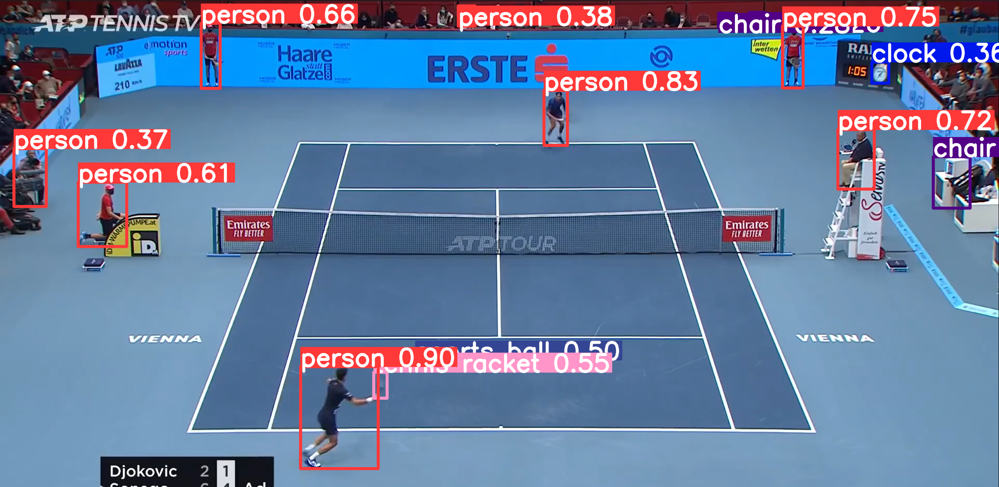

# Tennis Match Analysis Project

## Overview

This project aims to bring computer vision technologies into the realm of tennis sports analytics. By utilizing advanced machine learning models, the system is designed to detect and track players and tennis balls throughout video footage of matches. This projects solution extends beyond simple tracking; it comprehensively understands the spatial dynamics of the game by detecting key points of the tennis court. This allows for an in-depth analysis of player positioning, ball trajectories, distances covered, and the precision of shots. 

## Features

- **Player and Ball Detection**: Utilizes YOLO, an object detection model, to accurately detect and track fast-moving tennis balls and players in real-time.
- **Court Key Points Detection**: Employs a Convolutional Neural Network (CNN) trained to identify the court's key points, assisting in strategic analysis.
- **Gameplay Analysis**:
  - Determines whether shots are in or out.
  - Counts the number of shots hit by each player.
  - Measures the velocity of each shot.
- **Player Movement Analysis**:
  - Calculates the speed of the players.
  - Evaluates the total distance covered by each player during a match.

## Technology Stack

- **PyTorch**: The project uses PyTorch to train both the YOLO and CNN models, leveraging its dynamic computational graph and efficient memory usage for high-speed analysis.
- **Object Detection Model (YOLO)**: Fine-tuned to enhance the detection accuracy of the default out-of-the-box models for the high-speed context of tennis.
- **Convolutional Neural Network**: Custom-built and trained to estimate the tennis court's key points, enabling a nuanced understanding of player positions and game dynamics.

## Getting Started

### Analyzing a Single Frame

To begin our analysis, we start with a static image of a tennis match. This initial step helps us understand the basics of image detection using the YOLO model.

Original Image:

After running this image through the YOLO model, we observe the following results:

Predicted Image:

In the predicted image, we can see that YOLO successfully detects various objects, including people, tennis rackets, and a clock. Each detected object is surrounded by a bounding box, accompanied by a class name and a confidence score, indicating the model's certainty about the object's identity.

### Analyzing a Video Sequence

Next, we apply YOLO to a video of a tennis match. In this scenario, YOLO analyzes each frame of the video and assigns bounding boxes, class names, and confidence scores to all detected objects.

Video Analysis:

However, we notice that the detection of the tennis ball (classified as "sports ball") is inconsistent across frames. To improve our analysis and gather more detailed information, we will need to fine-tune a detector model specifically for the tennis ball.

Stay tuned for further updates as we refine our model and enhance our tennis match analysis capabilities.

## Contributing

(Include guidelines on how others can contribute to the project.)

## License

(Include information about the project's license here, if applicable.)

## Contact

(Your contact information or that of the project maintainer.)

# Tennis Match Analyzer with YOLOv8x

This project utilizes the YOLOv8x (You Only Look Once, version 8x) object detection model to analyze and identify various elements in a live tennis match. The image demonstrates the model's ability to detect and classify objects with bounding boxes and confidence scores in real-time.

## Features

- **Real-Time Object Detection**: Using the YOLOv8x model, the application identifies and labels different objects in a tennis match scene.
- **Confidence Scoring**: Each object is recognized with a confidence score, reflecting the model's certainty about the object's identification.
- **Multi-Object Classification**: The model simultaneously classifies multiple objects, including tennis players, audience members, chairs, and sports equipment.
- **Sports Analytics**: This application can be utilized for sports analytics, providing insights into player positions, game statistics, and audience engagement.

## Application in Action

The provided image from a tennis match shows the YOLOv8x model's output. The model highlights:

- Bounding box.
- class name.
- Confidence score.
- Players on the court.
- Spectators around the court.
- The chair umpire.
- Tennis equipment, including the ball and racket.

Each object is enclosed in a bounding box with a label and a confidence score (e.g., 'person 0.83', 'clock 0.36', 'sports ball 0.50').

## Potential Use Cases

- **Player Performance Tracking**: Analyzing player movements and positions to aid in performance improvement strategies.
- **Audience Analysis**: Monitoring audience size and engagement levels.
- **Equipment Detection**: Keeping track of the ball and equipment for automated scoring systems.

## Future Enhancements

- Enhancing the model for even higher accuracy and speed.
- Expanding the number of recognizable objects specific to various sports.
- Integrating with video feeds for live match analysis.
